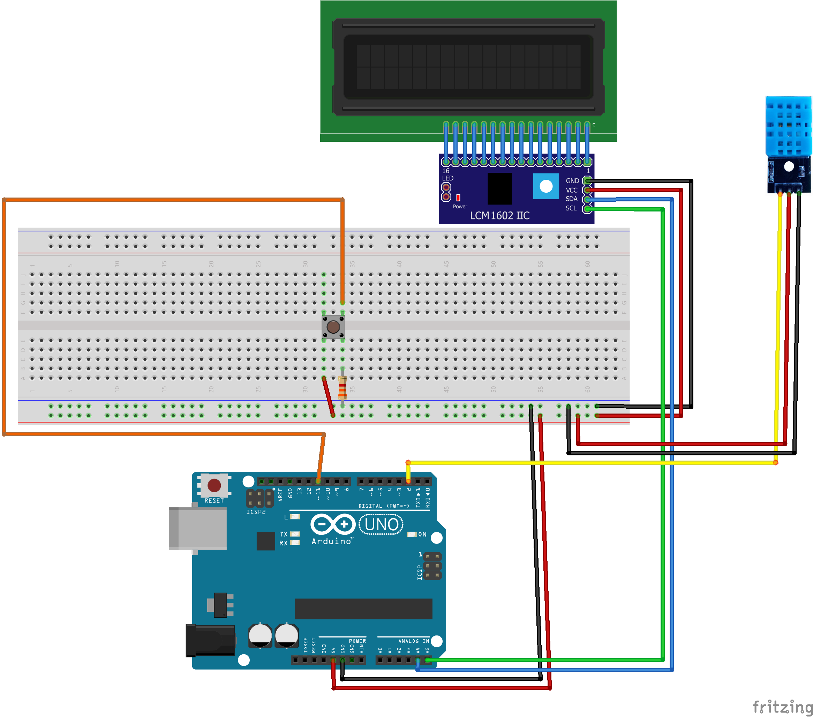

# Arduino Temperature & Humidity Monitoring
## Building an Temperature/Humidity Monitor using a DHT11 Sensor

For this project I wanted to know I could know the current temperature of my room using arduino. For that purpose I found out about the `DHT11` Temperature and Humidity Sensor, which I could connect to an Arduino and send it all the information I needed. 
 
For this simple project I followed some guides online in which all the code and schematics are based off.

The reference used was: https://arduinogetstarted.com/tutorials/arduino-temperature-humidity-sensor.

### Table of Contents

1. [Objective](#1-objective)
2. [Electrical Circuit](#2-electrical-circuit)
   1. [Material Needed](#21-material-needed)
        1. [Why do we need a I2C Module?](#211-why-do-we-need-a-i2c-module)
        2. [Why do we need a push button?](#212-why-do-we-need-a-push-button)
        3. [Why do we need a resistor?](#213-why-do-we-need-a-resistor)
   2. [Schematic](#22-schematic)
3. [Code](#3-code)
    1. [Library Dependencies](#31-library-dependencies)
4. [End Result](#4-end-result)

### 1. Objective

The objective is to use an `Arduino` to receive data about temperature and humidity from a `DHT11` Module, and display it using a `LCD I2C` (Liquid Crystal Display) Module.
Initially I only wanted to know about the temperature, but as I was researching about `DHT11`, I discovered that it can also sense humidity, so I will also gather that information from the sensor.

### 2. Electrical Circuit

#### 2.1 Material Needed

Here it is a list of the material needed:

| Image | Name | Quantity |
| :- | :-: | :-: |
|  | LCD 16x2 Screen | 1
|  | LCM1602 IIC ( I2C Module ) | 1
|  | DHT11 Temperature & Humidity Module | 1
|  | Arduino Uno R3 | 1
|  | Jumper Wires | 11
|  | Breadboard | 1
|  | Push Button | 1
|  | Resistor (~ 3.3k Ohms) | 1

_Note that you can use more or less of some of the components listed above, this is just an example of how to build this circuit._
 
_As long as the resistor has a value bigger than 1k Ohm, this circuit should work as intented._

##### __2.1.1 Why do we need a I2C Module?__

As the [Arduino Guide for LDC I2C 16x2](https://arduinogetstarted.com/tutorials/arduino-lcd-i2c) states, the wiring between the Arduino and the normal LCD is complicated. Therefore we use a I2C Module  to create a __LCD I2C__, composed of a normal LCD, an I2C Module, and a potentiometer. This way we can drastically reduce the amount of pins required, from our Arduino, to control de LCD.

With that being said, it is absolutely possible to do this project without using the I2C Module, it just means that wiring the LCD to the Arduino will be a little more complicated.

##### __2.1.2 Why do we need a push button?__

The button is not necessary for the main purpose of this project: get temperature and humidity.
 
Despite that, I wanted to make a way to change the temperature from Celsius to Fahrenheit, and vice-versa. So pressing the button changes the temperature measure unit.

##### __2.1.3 Why do we need a resistor?__

The purpose of the resistor connected to the button is to avoid [_floating pins_](https://www.programmingelectronics.com/floating-pins-pull-up-resistors-and-arduino/), which, in short, means that we use a pull-down resistor to set the defaut state of the arduino pin as 0V (GND). Without that, the pin would be unstable , seeing that it was not connected to either GND nor VCC. That in turn, would make the input pin value only depend on eletrical noise and so, it would be constantly changing between HIGH and LOW.
 
When the button is pressed, that pin gets connected to 5V (VCC) and so the Arduino pin gets a HIGH.

For more information, [here's another link](https://www.mouser.com/blog/dont-leave-your-pins-floating) that might be useful.

#### 2.2 Schematic

The following image shows how to connect all the components listed above:

This schematic was designed using a software named [Fritzing](https://fritzing.org/download/).

It's possible that the `LCM 1602 IIC I2C Module` is already attached to your `LCD`, but for this schematics we assume both components are separated.
 
The `DHT11 Module` could also be substituted by a simpler version, the `DHT11 Sensor`. In practice the only difference would be the amount of wires needed to connect the sensor to the rest of the circuit. Also, depending on your model, the _SIGNAL, GND_ and _VCC_ pins of the sensor might be arranged in different orders, so be aware of that.

For information about the purpose of each pin of the components, I recommend researching in the following links:

* [LCD I2C](https://arduinogetstarted.com/tutorials/arduino-lcd-i2c)
* [SDA and SCL](https://www.circuitbasics.com/basics-of-the-i2c-communication-protocol/)
* [I2C Protocol](https://www.robot-electronics.co.uk/i2c-tutorial#:~:text=SCL%20is%20the%20clock%20line,the%20ground%20or%200%20volts.)

### 3. Code

In this project we program an [Arduino](https://www.arduino.cc/en/software) to follow this logic. 
 
For details of the code, go to [`src`](./src/). 
 
The [`main.ino`](./src/main/main.ino) file should be uploaded to the Arduino after the [circuit](#22-schematic) is built.
 
The [`i2c_address_scanner.ino`](./src/i2c_address_scanner/i2c_address_scanner.ino) file can be used to check the address of your `LCD`. For details of why this is important, check this [link](https://lastminuteengineers.com/i2c-lcd-arduino-tutorial/#:~:text=pin%20labeled%20%E2%80%98LED%E2%80%99.-,I2C%20Address%20of%20LCD,-If%20you%20have).

#### 3.1 Library Dependencies

For the code to work, you will need to install the following Arduino Libraries:

| Name | Author |
| :- | :- |
| Adafruit Unified Sensor | Adafruit  |
| DHT sensor library | Adafruit  |
| LiquidCrystal I2C | Frank de Brabander |

### 4. End Result

After [building the circuit](#2-Electrical-circuit) and [uploading the code to the Arduino](#3-code), the end result should look like this:

  

If you notice the amount of wires shown is higher than the amount listed in the [materials](#21-material-needed) section, it's because I wanted to rearrange them in a better way for me to record this sample video.